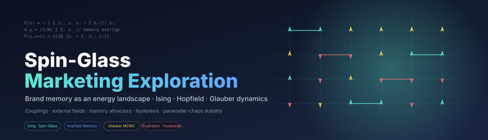

<p align="center">
  
</p>

<p align="center">
  <b>Brand Memory &amp; Campaign Dynamics — a marketing diagnostic workbench.</b><br/>
  Ising · Spin-Glass · Hopfield attractors · Glauber dynamics — applied to brand tracking and campaign measurement<br/>
  Made by <a href="https://github.com/matiyashu">Prima Hanura Akbar</a>
</p>

<p align="center">
  
  
  
  
  
</p>

---

## What is this?

**Spin-Glass Marketing Exploration** is a small research workbench that treats a market as a system of interacting binary states and asks: *how does a campaign reshape the landscape that brand memory lives in?*

Each consumer signal — ad recall, brand link, trust, value-for-money, premium, fun, consideration, competitor salience — is modeled as a **spin** in {−1, +1}. Reinforcing associations get **positive couplings**; tensions (premium vs value, brand link vs competitor salience) get **negative couplings**. A campaign is the **external field** `h(t)` that biases certain spins, and a desired brand memory is encoded as a **Hopfield attractor** in the coupling matrix.

The repo ships:

- A **Next.js dashboard** (`frontend/`) organised around the marketing hierarchy **Brand → Product / Vertical → Market / Segment → Campaign**. A global context selector drives every screen: brand memory maps, tensions and frustrated triads, segment fragmentation, rolling regime, replica/landscape fragmentation, campaign field simulation, and observed validation. Every chart carries a **scientific-status** badge (measured / simulation / illustrative / experimental) and a **data-sufficiency** badge.
- A small NumPy kernel (`backend/brand_ising_spin_glass.py`) plus a marketing compute layer (`backend/marketing_kernel.py`) with coupling estimators (signed correlation, Ising, signed mutual-information), Hopfield memory, Glauber MCMC, triad frustration, replica overlap P(q), a labelled rigidity proxy, susceptibility, and campaign field construction.
- An optional **FastAPI** service (`backend/api/`) exposing the marketing endpoints for live compute, plus a synthetic-data pipeline (`backend/scripts/`) that generates a marketing-shaped demo dataset and the bundled JSON the dashboard reads.
- The commodity **paper benchmark** (the original V2 rolling-couplings workflow) kept as a methodology reference behind a dev flag, plus a PDF [technical brief](backend/docs/spin_glass_brand_marketing_report.pdf).
- An honest framing of what this is and isn't: a **diagnostic and simulation workbench**, not a prediction oracle. Outcome calibration stays disabled until real sales/conversion data is supplied.

**Why bother.** Standard brand trackers report KPI deltas in isolation. The spin-glass framing forces you to answer the questions KPI tables can't: *do my brand associations move together, or fragment?*, *does this campaign retrieve the memory I intend, or activate the competitor's pattern?*, *is the lift a quick perturbation, or did it deepen a basin?*, *will this impact survive a category shock?*

> ⚠️ **This is an exploration, not a production model.** The math is correct, the figures are reproducible, but the engine is calibrated to *synthetic* data. Plugging in a real tracker is the next step, and the README explains how.

---

## Quick start — the dashboard

```bash
git clone https://github.com/matiyashu/spinglass-marketing-exploration.git
cd spinglass-marketing-exploration

# 1. Generate the marketing demo dataset + bundled JSON (one-shot)
cd backend
python -m venv .venv && .venv\Scripts\activate     # Windows; or: source .venv/bin/activate
pip install -r requirements-api.txt                #  (pulls in requirements.txt too)
python scripts/generate_v3_marketing_data.py       # → sample_data/v3_marketing/ + expected_outputs/
python scripts/dump_v3_demo_json.py                # → frontend/public/demo/v3/*.json

# 2. (optional) live-compute backend
python -m uvicorn api.main:app --port 8000         # http://localhost:8000/docs

# 3. the dashboard
cd ../frontend
npm install
npm run dev                                        # http://localhost:3760
```

The **Demo** workspace runs entirely off the bundled JSON — no backend needed. Switch to the **Live**
workspace to compute against the FastAPI service. The commodity paper benchmark is hidden from the nav unless
you set `NEXT_PUBLIC_SHOW_METHOD_BENCHMARK=true`. Run `python scripts/verify_v3_endpoints.py` to confirm the
live endpoints reproduce the demo bundle and `expected_outputs/` to machine precision.

### Kernel & PDF brief (optional CLI)

```bash
cd backend
python brand_ising_spin_glass.py                   # CLI demo of the kernel
python generate_spin_glass_marketing_report.py     # 12-page PDF + 5 standalone figures
```

→ `backend/docs/spin_glass_brand_marketing_report.pdf` and `backend/spin_glass_report_figures/*.png`
(signed coupling heatmap, scenario metrics, pulse response, hysteresis, energy landscape). The pulse,
hysteresis and energy-landscape figures are *illustrative theory* — they also appear under Methods › Theory
explainers in the dashboard.

---

## The core analogy

| Marketing concept                | Spin-glass object                                       |
|----------------------------------|----------------------------------------------------------|
| Consumer state / brand association | spin `s_i ∈ {−1, +1}`                                   |
| Reinforcing pair (trust ↔ consider) | positive coupling `J_ij > 0`                            |
| Tension pair (premium ↔ value)     | negative coupling `J_ij < 0` *(spin-glass, not Ising)*  |
| Campaign / media / promo         | external field `h_i(t)`                                  |
| Desired brand memory             | Hopfield pattern `ξ`, stored as attractor in `J`         |
| Market volatility                | temperature `T = 1/β`                                    |
| Brand-memory retrieval           | overlap `m_μ = (1/N) Σ ξ_i s_i`                          |
| Fragmented meaning               | frustration: violated signed edges                       |
| Stickiness of a new state        | hysteresis width                                         |
| Fragility under macro shock      | parameter-chaos overlap `q(T, T+δT)`                     |

The system Hamiltonian:

```
E(s; t) = −½ Σ_{i≠j} J_ij s_i s_j  −  Σ_i h_i(t) s_i
P(s_i = +1 | s_{−i}) = σ(2β [h_i(t) + Σ_j J_ij s_j])
```

Glauber sampling explores the landscape; reading off `m_μ`, frustration, and competitor overlap turns the sample into KPIs.

---

## Inside the dashboard

Every screen answers a marketing question for a chosen **brand → product → vertical → market → segment →
campaign**, picked once in the context bar and inherited everywhere. Two workspaces: **Demo** (bundled
synthetic data, no backend) and **Live** (computes through the FastAPI service).

| Section | Screens | Answers |
|---|---|---|
| **Brand portfolio** | Portfolio overview · Memory map · Tensions · Competitive leakage | What does the brand mean, and where is it coherent vs contradictory? |
| **Product / vertical** | Vertical overview · Product memory fit · Segment differences · Switching risk | Which product / audience encodes the brand differently? |
| **Campaigns** | Overview · Creative memory pattern · Field response · Scenario simulator · Observed validation | What did the creative intend, what actually moved, was it durable? |
| **Dynamics & stability** | Rolling regime · Memory persistence · Replica / fragmentation · Stress test | Is the structure stable over waves, segments and shocks? |
| **Reports** | Executive report · Technical appendix | A context-scoped summary plus the formulas behind it. |
| **Methods** | Model glossary · Theory explainers · Paper benchmark *(dev flag)* | Definitions, illustrative theory, and the commodity reference. |

### Every chart is labelled twice

This is the discipline that keeps the framing honest:

- **Scientific status** — `measured` (estimated from data) · `simulation` (from declared parameters) ·
  `illustrative` (mathematical form, not data) · `experimental` (unvalidated heuristic, e.g. signed MI).
- **Data sufficiency** — whether the *currently supplied* data enables a method. Outcome validation stays
  disabled until you ship outcome data; there is deliberately **no purchase-probability forecast** until a
  validated outcome model exists. Replica analysis keeps *landscape* (simulation) and *estimation-stability*
  (bootstrap) P(q) in **separate** panels — a broad P(q) in a finite panel is a competing-meanings signal,
  not a claim of replica-symmetry breaking.

### The demo dataset

A synthetic but marketing-shaped panel: **2 brands × 3 products × 2 verticals × 3 markets × 4 segments ×
24 monthly tracker waves × 6 campaigns**, ten association features, and *partial* outcomes (so the UI can show
methods enabling and disabling honestly). The generator bakes in real signal — segment-varying couplings,
campaign windows that shift their targeted associations, competitor spend that lifts competitor salience.
`scripts/generate_v3_marketing_data.py` also writes `expected_outputs/` QA targets that the live endpoints
reproduce to machine precision (`scripts/verify_v3_endpoints.py`).

> 📖 **Full program manual** — every screen, the formula behind it, how to read the results, and worked use
> cases: **[docs/DASHBOARD_MANUAL.md](docs/DASHBOARD_MANUAL.md)**.

---

## The kernel, in one screen

```python
# from backend/
from brand_ising_spin_glass import (
    FEATURES, binarize_to_spins, corr_couplings, mi_couplings,
    memory_couplings, infer_mean_field_baseline,
    glauber_sample, memory_overlap, frustration_rate,
    summarize_scenario, ScenarioResult,
)

# 1. Spins from your panel
spins = binarize_to_spins(survey_df[FEATURES])

# 2. Couplings
J_sg = corr_couplings(spins, mode="spin_glass", scale=0.55)   # signed
J_mi = mi_couplings(spins, signed=True, scale=0.55)           # nonlinear

# 3. Plant the desired brand memory
target = np.array([1, 1, 1, 1, 1, -1, 1, 1, 1, -1])
J = J_sg + memory_couplings(target.reshape(1, -1), strength=0.35)

# 4. Field = baseline + campaign push
h0 = infer_mean_field_baseline(spins, J, beta=1.0)
h_campaign = h0 + spend * target

# 5. Sample, score
samples = glauber_sample(J, h_campaign, beta=1.0)
print(memory_overlap(samples, target), frustration_rate(samples, J))
```

The module is intentionally tiny (~250 LOC, NumPy + pandas). Everything else — figures, PDF, scenarios — sits on top.

---

## Repository layout

```
spinglass-marketing-exploration/
├── README.md
├── LICENSE  ·  .gitignore  ·  assets/banner.svg
├── backend/                                       # Python kernel + compute + API
│   ├── brand_ising_spin_glass.py                  # paper-clean kernel + demo()
│   ├── marketing_kernel.py                        # V3 marketing compute layer
│   ├── generate_spin_glass_marketing_report.py    # figures + PDF builder
│   ├── api/                                        # FastAPI live-compute service
│   │   ├── main.py · routes.py · schemas.py
│   ├── scripts/                                    # data pipeline + verification
│   │   ├── generate_v3_marketing_data.py          # synthetic marketing dataset
│   │   ├── dump_v3_demo_json.py                    # → frontend/public/demo/v3
│   │   └── verify_v3_endpoints.py                  # reproduction checks
│   └── sample_data/v3_marketing/                   # CSVs + expected_outputs/ (QA)
├── frontend/                                      # Next.js 14 dashboard
│   ├── app/dashboard/                              # workspace / brands / verticals
│   │   │                                           #  campaigns / dynamics / reports / methods
│   ├── components/  ·  lib/  (context, workspace, marketing loader)
│   └── public/demo/v3/                             # bundled demo JSON
├── docs/                                          # V2 + V3 alignment plans
└── skills/                                        # LOCAL ONLY — gitignored
```

**backend** holds the kernel, the marketing compute layer, the FastAPI service and the synthetic-data
pipeline; **frontend** is the marketing-first dashboard. The generator → dump → bundle pipeline means the
demo JSON and the live endpoints compute through the same `marketing_kernel`, so they agree by construction.

`skills/` is **excluded from git** via `.gitignore`. It exists only on the local clone for AI-assisted development and never leaves this machine.

---

## Use cases this framing unlocks

| Use case | Spin-glass measurement | Decision output |
|---|---|---|
| Campaign pretest | Target overlap `m_μ`, competitor overlap, response `R(t,t')` | Launch / revise cueing / raise media pressure |
| Brand-memory tracking | Rolling `J_ij`, frustration, largest eigenvalue, MI couplings | Find durable assets and weakening links |
| Competitive leakage | Overlap with competitor pattern, negative brand-link couplings | Rework distinctive assets and brand linkage |
| Promo vs equity tradeoff | Negative `J` between value and premium, preference hysteresis | Set promotion guardrails and recovery spend |
| Segment strategy | Segment-specific `J`, `h`, `q(T, T+δT)`, response half-life | Stable conversion segments vs memory-building segments |
| Launch tipping point | RFIM threshold, hysteresis width, basin depth | Minimum viable burst + maintenance spend |

The detailed math, formulas, and a full applied-use-cases section live in [the PDF brief](docs/spin_glass_brand_marketing_report.pdf).

---

## What this is not

- **Not a forecasting model.** It's diagnostic and structural. There is **no purchase-probability or sales forecast** in the dashboard — outcome calibration stays disabled until you supply real sales/conversion data and fit the validation layer. The simulator is explicitly labelled *simulation from declared parameters*.
- **Not a replacement for brand-lift studies, MMM, or longitudinal tracking.** It's a *lens* you point at those inputs to read structure that single-KPI tables hide.
- **Not Ising-only.** The signed-correlation (spin-glass) view is the centerpiece — the Ising `|corr|` version is included as a synchronization benchmark, because suppressing the signs loses the most interesting marketing structure (the *tensions*).
- **Not yet calibrated to a real tracker.** All numbers in the demo come from a synthetic panel. Calibration to a real Brand Health Tracker wave is the natural next step.

---

## Source concepts the brief draws on

- Rolling Ising / spin-glass coupling matrices from correlation and mutual information *(stat-physics applied to interacting systems)*.
- Spin-glass models in economics as heterogeneous interacting agents *(disordered systems / quenched randomness)*.
- Neural-network memory as stable stored spin patterns *(Hopfield, Amit–Gutfreund–Sompolinsky)*.
- Aging, frustration, and dynamical mean-field concepts from spin-glass theory.

---

## Local development with AI skills

For AI-assisted development this project pulls in two skill libraries **locally**. They are never pushed:

```bash
# from repo root, after .gitignore is in place
mkdir -p skills
git clone --depth 1 https://github.com/thedotmack/claude-mem skills/claude-mem
git clone --depth 1 https://github.com/obra/superpowers     skills/superpowers
```

The `skills/` entry in `.gitignore` ensures these stay on your machine. Refer to each repo's own README for setup and usage; nothing in this project depends on them at runtime.

---

## Roadmap

- [x] **V2** — paper-aligned commodity rolling-couplings backend + scientific-status framing.
- [x] **V3** — marketing-first reframe: brand → product → segment → campaign hierarchy, synthetic marketing
      dataset, live couplings/tensions/segments/replicas, campaign field simulation vs observed validation,
      method-status governance, executive + technical reports.
- [ ] Calibrate against a real brand-tracker wave (binary pick-any data) and fit the outcome-validation layer.
- [ ] Inverse-Ising (pseudolikelihood) estimator alongside the correlation proxy.
- [ ] Upload-driven Live workspace: compute on user CSVs end-to-end, not just the bundled sample.
- [ ] Bridge to [Brand Health Tracker](https://github.com/matiyashu/Brand-Health-Tracker---Mental-Availability-Physical-Availability) — feed its CBM linkage matrix in as the coupling estimator.

---

## License

MIT — see [LICENSE](LICENSE).

---

<p align="center">
  <sub>Spin-glass and Ising frames borrowed from statistical physics; brand health discipline borrowed from Ehrenberg-Bass.<br/>
  All errors of translation are mine.</sub>
</p>
